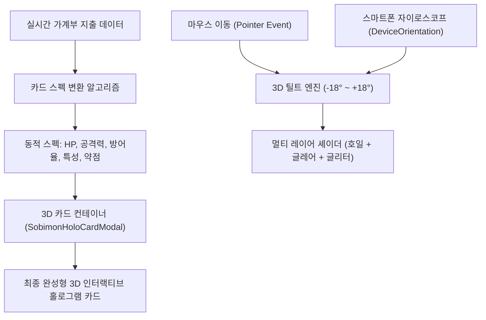

# 🎴 소비몬(SOBIMON) 동적 홀로그램 카드 시스템 기술 명세서

> **문서 목적**: 순수 HTML/CSS 및 알고리즘으로 동적 생성되는 3D 홀로그램 포켓몬 TCG 카드 시스템(`simeydotme/pokemon-cards-css` 기반)의 셰이더 기법, 자이로스코프 센서 연동, 가계부 지출 데이터 기반 동적 스펙 산출 공식을 체계적으로 정리하여 **차기 업데이트 시 동적 카드 기능으로 손쉽게 전환/적용**할 수 있도록 보존한 기술 문서입니다.

---

## 1. 3D 홀로그램 카드 아키텍처 개요

소비몬의 홀로그램 카드는 고해상도 단일 이미지뿐만 아니라, **유저의 이번 달 지출 데이터에 따라 실시간으로 스탯이 변하는 절차적(Procedural) 동적 카드**로 작동할 수 있도록 설계되었습니다.



---

## 2. 홀로그램 셰이더 구조 (`simeydotme/pokemon-cards-css` 원본 레시피 이식)

> ⚠️ **2026-09-09 갱신**: 예전에는 자체 근사치 그라디언트(대각선 무지개 밴드 + 글리터 점묘)를 썼지만, 지금은 `poke-151.simey.me`(원작자의 실제 데모 사이트)에서 CSS·JS 번들을 직접 fetch해 "Rare Holo" 등급의 수식·색상·블렌드 모드를 그대로 이식했습니다. 계산된 값을 React state로 인라인 스타일에 직접 박아넣던 방식에서, `.holo-card-3d` 루트에 CSS 커스텀 프로퍼티(`--rotate-x`, `--pointer-x`, `--background-x`, `--card-opacity` 등)를 설정하고 하위 레이어가 `var()`로 참조하는 원본과 동일한 구조로 전환했습니다. 자세한 변경 배경은 [6. 변경 이력](#6-변경-이력-changelog) 참고.

### 2.1 무지개 회절광 + 포일 스캔라인 (`card__shine` → `.holo-card-shine`)
- 6가지 "sunpillar" 색상(`--sunpillar-1~6`, HSL)을 `repeating-linear-gradient(10deg, ...)`로 반복시켜 대각선 무지개 밴드를 만듭니다.
- `::before` 가상 요소가 틸트 각도(`--rotate-x`)에 반응하는 금속 스캔라인(포일 결) 패턴을 추가로 얹습니다.
- `::after` 가상 요소는 포인터 위치 기반 `radial-gradient`로 입체 조명 감쇠(luminosity)를 표현합니다.
```css
.holo-card-shine {
  background-image: repeating-linear-gradient(
    10deg, var(--holo), var(--holo), var(--holo), var(--holo), var(--holo), var(--holo), var(--holo)
  );
  background-position: calc(((50% - var(--background-x, 50%))) + 50%) calc(((50% - var(--background-y, 50%))) + 50%);
  background-size: 400% 400%;
  background-blend-mode: overlay;
  filter: brightness(1.25) contrast(3) saturate(0.75);
  mix-blend-mode: overlay;
  opacity: var(--card-opacity, 0);
}
```
(`::before`/`::after` 전체 코드는 `src/index.css`의 `.holo-card-shine` 블록 참고)

### 2.2 포인터 추적 글레어 (`card__glare` → `.holo-card-glare`)
- 포인터 좌표(`--pointer-x`, `--pointer-y`)를 중심으로 한 `radial-gradient` 하이라이트 두 겹(`::after` 포함)으로 구성됩니다.
```css
.holo-card-glare {
  background-image: radial-gradient(
    farthest-corner circle at var(--pointer-x, 50%) var(--pointer-y, 50%),
    hsla(0, 0%, 100%, 0.8) 10%, hsla(0, 0%, 100%, 0.65) 20%, hsla(0, 0%, 0%, 0.5) 120%
  );
  opacity: calc(var(--card-opacity, 0) * 0.8);
  mix-blend-mode: overlay;
}
```

### 2.3 (제거됨) 코스믹 글리터 스타버스트
> 기존 3단계 글리터 레이어(`.holo-layer-sparkles`)는 삭제했습니다. 원본 사이트에서 별빛 입자(`card__glitter`)는 "Rare Holo"가 아닌 코스모스(Cosmos)/마스터볼 홀로 전용 레이어이며, 기본 카드에는 `display: none` 처리되어 있습니다. 소비몬 카드는 전부 "Rare Holo" 레시피를 쓰므로 이 레이어는 존재하지 않아야 정확합니다.

### 2.4 속성 색상 테두리 발광 (신규 추가)
- 원본의 `.card__rotator` box-shadow를 그대로 이식. 카드별 속성 색상(`spec.elementColor`)이 `--card-glow`로 주입되어 테두리가 은은하게 빛납니다.
```css
box-shadow:
  0 0 3px -1px white,
  0 0 3px 1px var(--card-edge),
  0 0 12px 2px var(--card-glow),
  0 25px 60px -10px rgba(0, 0, 0, .65),
  0 0 40px -30px var(--card-glow),
  0 0 50px -20px var(--card-glow);
```

---

## 3. 3D 인터랙티브 틸트 & 자이로스코프 엔진

> **2026-09-09 갱신**: 아래 수식은 `poke-151.simey.me` 원본 번들에서 그대로 가져온 버전입니다. 공용 유틸(`clamp`/`round`/`adjust`)은 `SobimonHoloCardModal.jsx` 상단에 정의되어 있습니다.

### 3.1 마우스/터치 포인터 트래킹
```javascript
const clamp = (v, min = 0, max = 100) => Math.min(Math.max(v, min), max);
const round = (v, p = 3) => parseFloat(v.toFixed(p));
const adjust = (v, fromMin, fromMax, toMin, toMax) =>
  round(toMin + ((toMax - toMin) * (v - fromMin)) / (fromMax - fromMin));

const percentX = clamp(round((100 / rect.width) * x));
const percentY = clamp(round((100 / rect.height) * y));
const centerX = percentX - 50;
const centerY = percentY - 50;

setTilt({
  rotateX: round(-(centerX / 3.5)),   // --rotate-x (transform의 rotateY 축에 적용)
  rotateY: round(centerY / 2),        // --rotate-y (transform의 rotateX 축에 적용)
  pointerX: round(percentX),
  pointerY: round(percentY),
  cardOpacity: 1,
  bgX: adjust(percentX, 0, 100, 37, 63),
  bgY: adjust(percentY, 0, 100, 33, 67)
});
```

### 3.2 스마트폰 자이로스코프 (`DeviceOrientationEvent`) 연동 로직
- iOS 13+ 권한 요청(`requestPermission`) 처리 및 Android 자동 감지.
- ~~파지각을 `beta: 약 45°` 고정값으로 가정~~ → **최초 감지된 기울기를 기준각(0)으로 캡처해 이후 상대 변화량만 사용**하도록 변경 (사용자·자세마다 실제 파지각이 다르기 때문에 고정값 가정은 부정확함).
```javascript
if (!gyroBaseRef.current) {
  gyroBaseRef.current = { gamma, beta };
}
const relGamma = gamma - gyroBaseRef.current.gamma;
const relBeta = beta - gyroBaseRef.current.beta;

const limX = 16, limY = 18;
const zx = clamp(relGamma, -limX, limX);
const zy = clamp(relBeta, -limY, limY);

setTilt({
  rotateX: round(zx * -1),
  rotateY: round(zy),
  pointerX: adjust(zx, -limX, limX, 0, 100),
  pointerY: adjust(zy, -limY, limY, 0, 100),
  cardOpacity: 1,
  bgX: adjust(zx, -limX, limX, 37, 63),
  bgY: adjust(zy, -limY, limY, 33, 67)
});
```

---

## 4. 지출 데이터 기반 카드 스펙 산출 공식 (Dynamic Algorithm)

| 카드 스펙 항목 | 포켓몬 TCG 대응 항목 | 소비몬 알고리즘 산출 로직 |
| :--- | :--- | :--- |
| **HP (체력)** | 기본 생명력 | `기본 100 + (해당 카테고리 이번 달 지출액 / 1,000원)` |
| **Stage (진화 단계)** | 기본 / 1진화 / 2진화 | 결제 횟수: 1~5회(기본), 6~15회(1진화), 16회 이상(VMAX) |
| **Attack (스킬 데미지)** | 기술 공격력 | 해당 카테고리에서 발생한 **단일 건 최대 결제액** |
| **Rarity (희귀도)** | C / U / R / UR / Secret | 예산 대비 소진율: ~50%(Normal), ~90%(Rare), 100% 초과(Legend) |
| **Weakness (약점)** | 약점 및 2배 피해 | 해당 지출을 줄일 수 있는 대표 절약 행동 (예: 텀블러 할인, 냉장고 파먹기) |
| **Resistance (저항력)** | 데미지 감소 | 유저가 지출을 방어한 결제 수단 (예: 지역화폐 10% 페이백) |

---

## 5. 차기 업데이트 적용 방법

현재 도감 모달(`SobimonHoloCardModal.jsx`)에서 이미지 모드와 절차적 HTML 카드 모드를 탭 형태로 전환할 수 있도록 모듈화되어 있습니다. 추후 유저의 실제 월간 통계에 맞춰 카드가 성장하고 진화하는 기능을 열고자 할 때, 본 문서의 알고리즘 훅(`useSobimonDynamicSpec`)을 연결하여 활성화하면 됩니다.

---

## 6. 변경 이력 (Changelog)

### 2026-09-09 (1차) — `poke-151.simey.me` 원본 레시피 완전 이식
- **배경**: 도감 카드 클릭 시 나타나는 홀로그램 효과를 `https://poke-151.simey.me/?poke=lets-go`(예: `data-rarity="rare holo"` 워터 타입 카드)와 동일하게 만들어달라는 요청.
- **조사 방법**: 해당 사이트가 오픈소스 프로젝트 `simeydotme/pokemon-cards-css`의 공식 데모임을 확인하고, 실제 배포된 CSS(`base.css`, `cards.css`, `regular-holo.css`)와 번들 JS(포인터 트래킹 수식)를 직접 fetch하여 분석.
- **변경 파일**: `src/components/common/SobimonHoloCardModal.jsx`, `src/components/pc/admin/MonsterCreatorStudio.jsx`(관리자 미리보기도 동일 시스템으로 통일), `src/index.css`.
- **핵심 변경**:
  1. `.holo-layer-glare` / `.holo-layer-rainbow` / `.holo-layer-sparkles`(자체 근사치) → `.holo-card-shine` / `.holo-card-glare`(+ `::before`/`::after` 가상 요소, 원본 수식 그대로)로 교체.
  2. React state로 직접 계산하던 인라인 스타일 값들을 CSS 커스텀 프로퍼티(`--rotate-x`, `--pointer-x`, `--background-x`, `--card-opacity` 등)로 전환하여 원본과 동일한 CSS 아키텍처 적용.
  3. 포인터/자이로 트래킹 공식을 원본의 `clamp`/`round`/`adjust` 유틸과 동일한 수치(분모 3.5 / 2, 배경 범위 37~63% / 33~67% 등)로 교체.
  4. 자이로 보정 방식을 고정 45° 가정 → 최초 이벤트 기준 상대각 계산으로 변경.
  5. 카드 타입 색상 기반 테두리 발광(box-shadow) 추가.
  6. 코스믹 글리터 레이어 제거 (원본에서도 Rare Holo 등급에는 존재하지 않는 레이어였음).
- **알려진 한계**: 원본 사이트는 카드마다 실루엣 알파 마스크(PNG)를 별도로 두어 홀로 효과를 일러스트 영역에만 마스킹하지만, 소비몬 카드 이미지는 텍스트까지 포함된 완성형 PNG 한 장이라 마스크 에셋이 없어 카드 전체 면적에 효과가 적용됩니다.

### 2026-09-09 (2차) — 실기기에서 카드 이미지가 안 보이고 검은 배경 위에 홀로 줄무늬만 보이는 버그 수정
- **증상**: 1차 작업 직후 사용자가 실제 앱에서 카드에 마우스를 올리면, 카드 원본 이미지는 전혀 보이지 않고 새까만 배경 위에 무지개색 줄무늬와 하얀 글레어 원만 떠 있는 상태로 렌더링됨 (개발 중 헤드리스 브라우저 테스트에서는 정상으로 보였음).
- **원인 분석**: `.holo-card-3d`는 `transform-style: preserve-3d`로 앞/뒷면(카드 이미지, 홀로 레이어, 뒷면 디자인)을 하나의 3D 공간에 배치하고 `rotateY(180deg)`로 뒷면을 뒤집어 감춥니다. 이 3D 공간 안에서 `.holo-card-shine`/`.holo-card-glare`처럼 `mix-blend-mode`(overlay 등)를 쓰는 레이어들이 명시적인 Z축 위치 없이 이미지와 같은 z=0 평면에 겹쳐 있으면, 하드웨어 가속(GPU 컴포지팅)이 켜진 실제 브라우저에서는 블렌드 대상(배경)을 카드 이미지가 아닌 검은 배경으로 잘못 인식하는 렌더링 버그가 발생합니다. 헤드리스 테스트 환경은 소프트웨어 렌더링 경로를 타는 경우가 많아 이 버그가 재현되지 않았습니다.
  - 원본 `pokemon-cards-css`는 이 문제를 이미 알고, `card__shine`(`translateZ(1px)`), `card__shine:after`(`translateZ(1.2px)`), `card__glare`(`translateZ(1.41px)`), `card__front`/이미지(`translateZ(0.01px)`), `card__back`(`rotateY(180deg) translateZ(1px)`)처럼 **모든 3D 레이어에 서로 다른 미세 Z축 오프셋을 명시적으로 지정**해 GPU 컴포지터가 레이어 순서를 정확히 계산하도록 강제하는 방식으로 회피하고 있었는데, 이 부분을 1차 이식 시 누락했습니다.
- **재현 및 검증 방법**: 컴파일된 CSS를 그대로 로드하는 정적 테스트 페이지를 만들어 Playwright(GPU 가속 옵션 포함)로 실제 카드와 동일하게 앞/뒷면 두 개 레이어 + `preserve-3d` 구조를 그대로 구성 → 버그가 그대로 재현됨을 확인 → 누락된 `translateZ` 값들을 원본과 동일하게 추가 → 같은 테스트에서 카드 이미지 위에 무지개 호일과 글레어가 정상적으로 겹쳐 보임을 스크린샷으로 확인.
- **변경 파일**: `src/index.css` (`.holo-card-front`, `.holo-card-front img`, `.holo-card-shine`, `.holo-card-shine::before`, `.holo-card-shine::after`, `.holo-card-glare`, `.holo-card-back`에 `transform: translateZ(...)` 추가). JS/JSX 변경 없음.
