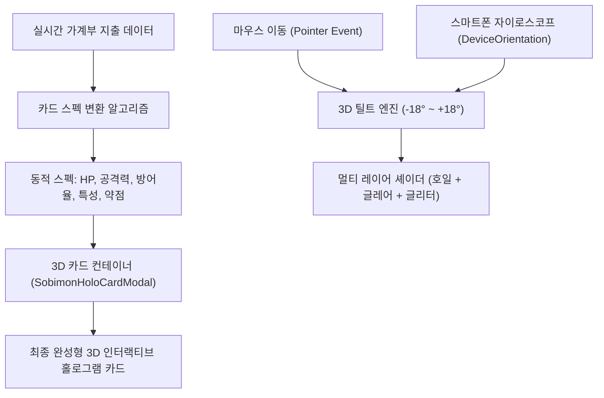

# 🎴 소비몬(SOBIMON) 동적 홀로그램 카드 시스템 기술 명세서

> **문서 목적**: 순수 HTML/CSS 및 알고리즘으로 동적 생성되는 3D 홀로그램 포켓몬 TCG 카드 시스템(`simeydotme/pokemon-cards-css` 기반)의 셰이더 기법, 자이로스코프 센서 연동, 가계부 지출 데이터 기반 동적 스펙 산출 공식을 체계적으로 정리하여 **차기 업데이트 시 동적 카드 기능으로 손쉽게 전환/적용**할 수 있도록 보존한 기술 문서입니다.

---

## 1. 3D 홀로그램 카드 아키텍처 개요

소비몬의 홀로그램 카드는 고해상도 단일 이미지뿐만 아니라, **유저의 이번 달 지출 데이터에 따라 실시간으로 스탯이 변하는 절차적(Procedural) 동적 카드**로 작동할 수 있도록 설계되었습니다.



---

## 2. 3중 레이어 홀로그램 셰이더 구조

포켓몬 공식 TCG 카드의 실물 질감을 재현하기 위해 3개의 가상 광학 레이어가 중첩됩니다.

### 2.1 1단계: 마우스/자이로 추적 글레어 (Light Glare Highlight)
- 카드를 바라보는 각도에 따라 광원이 카드 표면을 쓸고 지나가는 하이라이트 효과.
```css
.holo-layer-glare {
  position: absolute;
  inset: 0;
  border-radius: 20px;
  background: radial-gradient(
    circle at var(--glare-x, 50%) var(--glare-y, 50%),
    rgba(255, 255, 255, 0.85) 0%,
    rgba(255, 255, 255, 0.4) 22%,
    rgba(255, 255, 255, 0) 65%
  );
  mix-blend-mode: overlay;
  pointer-events: none;
  z-index: 5;
}
```

### 2.2 2단계: 무지개 회절광 호일 (Diffraction Rainbow Foil)
- 회절 격자(Diffraction Grating)를 통과한 무지개 스펙트럼 빛 반사.
```css
.holo-layer-rainbow {
  position: absolute;
  inset: 0;
  border-radius: 20px;
  background: repeating-linear-gradient(
    115deg,
    transparent 0%,
    rgba(255, 0, 150, 0.25) 12%,
    rgba(0, 200, 255, 0.35) 24%,
    rgba(0, 255, 128, 0.25) 36%,
    rgba(255, 230, 0, 0.3) 48%,
    rgba(255, 0, 100, 0.25) 60%,
    transparent 72%
  );
  background-size: 300% 300%;
  mix-blend-mode: color-dodge;
  opacity: 0.75;
  pointer-events: none;
  z-index: 6;
}
```

### 2.3 3단계: 코스믹 글리터 스타버스트 (Cosmic Glitter / Sparkles)
- 홀로그램 희귀 카드 특유의 반짝이는 별빛 입자 텍스처.
```css
.holo-layer-sparkles {
  position: absolute;
  inset: 0;
  border-radius: 20px;
  background-image: 
    radial-gradient(1.5px 1.5px at 20% 30%, #fff, rgba(0,0,0,0)),
    radial-gradient(2px 2px at 40% 70%, #ffd700, rgba(0,0,0,0)),
    radial-gradient(1px 1px at 65% 15%, #00ffff, rgba(0,0,0,0)),
    radial-gradient(2px 2px at 80% 85%, #ff69b4, rgba(0,0,0,0));
  background-size: 160px 160px;
  mix-blend-mode: screen;
  opacity: 0.6;
  pointer-events: none;
  z-index: 7;
}
```

---

## 3. 3D 인터랙티브 틸트 & 자이로스코프 엔진

### 3.1 스마트폰 자이로스코프 (`DeviceOrientationEvent`) 연동 로직
- iOS 13+ 권한 요청(`requestPermission`) 처리 및 Android 자동 감지.
- 스마트폰을 쥐고 있는 기본 파지각(`beta: 약 45°`)을 영점(Zero-point)으로 보정:
```javascript
const handleOrientation = (e) => {
  const gamma = e.gamma || 0; // 좌우 기울기 (-90 ~ 90)
  const beta = e.beta || 0;   // 앞뒤 기울기 (-180 ~ 180)

  // 기본 파지 각도 45도 기준 오프셋
  const deltaX = Math.max(-25, Math.min(25, gamma * 0.8));
  const deltaY = Math.max(-25, Math.min(25, (beta - 45) * 0.8));

  setTilt({
    rotateX: -deltaY * 0.7,
    rotateY: deltaX * 0.7,
    glareX: 50 + (deltaX / 25) * 45,
    glareY: 50 + (deltaY / 25) * 45,
    glareOpacity: 0.85,
    bgX: 50 + (deltaX / 25) * 40,
    bgY: 50 + (deltaY / 25) * 40
  });
};
```

---

## 4. 지출 데이터 기반 카드 스펙 산출 공식 (Dynamic Algorithm)

| 카드 스펙 항목 | 포켓몬 TCG 대응 항목 | 소비몬 알고리즘 산출 로직 |
| :--- | :--- | :--- |
| **HP (체력)** | 기본 생명력 | `기본 100 + (해당 카테고리 이번 달 지출액 / 1,000원)` |
| **Stage (진화 단계)** | 기본 / 1진화 / 2진화 | 결제 횟수: 1~5회(기본), 6~15회(1진화), 16회 이상(VMAX) |
| **Attack (스킬 데미지)** | 기술 공격력 | 해당 카테고리에서 발생한 **단일 건 최대 결제액** |
| **Rarity (희귀도)** | C / U / R / UR / Secret | 예산 대비 소진율: ~50%(Normal), ~90%(Rare), 100% 초과(Legend) |
| **Weakness (약점)** | 약점 및 2배 피해 | 해당 지출을 줄일 수 있는 대표 절약 행동 (예: 텀블러 할인, 냉장고 파먹기) |
| **Resistance (저항력)** | 데미지 감소 | 유저가 지출을 방어한 결제 수단 (예: 지역화폐 10% 페이백) |

---

## 5. 차기 업데이트 적용 방법

현재 도감 모달(`SobimonHoloCardModal.jsx`)에서 이미지 모드와 절차적 HTML 카드 모드를 탭 형태로 전환할 수 있도록 모듈화되어 있습니다. 추후 유저의 실제 월간 통계에 맞춰 카드가 성장하고 진화하는 기능을 열고자 할 때, 본 문서의 알고리즘 훅(`useSobimonDynamicSpec`)을 연결하여 활성화하면 됩니다.
