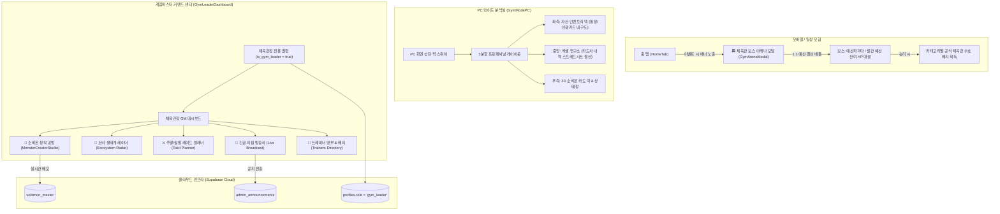

# 🏛️ 소비몬(SOBIMON) 체육관 모드 & 체육관장(GM) 스튜디오 기획 정리서

> **문서 목적**: 체육관 모드, 모바일 1:1 보스전 아레나, 그리고 체육관장(게임마스터) 전용 운영 어드민 및 몬스터 창작 공방 시스템을 정리하여, **차기 대규모 업데이트 시 즉시 반영 및 활성화**할 수 있도록 보존한 통합 기획/기술 명세서입니다.

---

## 1. 업데이트 보류 및 아카이빙 배경
- **현행 기조**: 초기 버전에서는 유저가 복잡함을 느끼지 않고, 가계부 본연의 기록 및 소비몬 수집(도감)의 직관적 재미에 집중하도록 UI를 심플하고 미니멀하게 유지.
- **차기 업데이트 목표**: 유저층이 가계부 기록에 익숙해진 후, 중·고급 유저를 위한 **월말 결산 배틀(체육관 모드)** 및 **게임마스터(체육관장) 운영 시스템**을 단계적으로 오픈.

---

## 2. 전체 시스템 아키텍처 & 구성도



---

## 3. 세부 기능 명세

### 3.1 모바일 체육관 아레나 (`GymArenaModal.jsx`)
- **진입 경로**: `HomeTab` 상단 배너 `[🏛️ 제 1 체육관: 예산 관장 배틀 OPEN]`.
- **보스 대미지 계산식**:
  - `유저 방어력 (체육관 HP)` = 이번 달 총 예산 - 누적 총 지출 (잔여 예산 %)
  - `보스 공격력` = 이번 달 지출 상위 1위 소비몬의 공격력 (예: 식비몬 18,000)
- **승리 조건**: 월말까지 예산 잔여율 15% 이상 유지 시 보스 제압 -> **`🏆 12월 예산 수호 배지`** 획득.

---

### 3.2 PC 체육관 와이드 분석실 (`GymModePC.jsx`)
1. **자산 인벤토리 덱 (Asset Inventory)**:
   - 결제 수단(신용카드, 체크카드, 비상금 통장)을 RPG 장비 덱으로 시각화.
   - 신용카드 한도 대비 사용률을 `내구도(Durability)`로 표현 (80% 초과 시 화재 경고 이펙트).
2. **소비몬 엑셀 정밀 연구소 (Statement Lab)**:
   - 이번 달 모든 결제 내역을 엑셀 스타일 테이블로 정밀 조회.
   - 날짜, 항목, 카테고리 태그, 소비몬 귀속, 결제 수단, 금액 표시.
   - 키보드 방향키 및 단축키로 빠른 검토 가능.
3. **소비몬 3D 덱 파트**:
   - 보유한 핵심 소비몬 카드를 우측에 상시 거치하여 소비 밸런스 점검.

---

### 3.3 체육관장(GM) 게임마스터 커맨드 센터 (`GymLeaderDashboard.jsx`)

#### ① 소비몬 창작 공방 (`MonsterCreatorStudio.jsx`)
- **실시간 반응형 3D 홀로그램 카드 프리뷰**:
  - 좌측 입력 폼:
    - 기본 정보: 소비몬 이름, 도감 번호(No.00X), 타입(식비, 카페, 쇼핑, 저축, 투자, 배달 등), 레벨/티어
    - 전투 스펙: 체력(HP), 절제력(공격력), 방어율(방어력), 치명타율(%)
    - 스킬 및 대사: 특성 이름, 발동 조건, 스킬 데미지, 플레이버 텍스트
  - 우측 3D 카드:
    - 마우스 커서 위치에 따라 3D 실시간 틸트 및 무지개 회절광/글레어 광택 연출.
    - `카드 뒤집기(Flip)` 지원 (몬스터 스펙 앞면 ↔ SOBIMON TCG 황금 몬스터볼 뒷면).
- **클라우드 원클릭 배포**:
  - `⚡ 전 세계 트레이너 도감에 즉시 배포 (DB 저장)` 클릭 시 `sobimon_master` 테이블에 즉시 INSERT / UPDATE.

#### ② 소비 생태계 레이더 (Ecosystem Radar)
- 전체 트레이너들의 총 소비액, 평균 예산 소진율, 가장 많이 소환된 인기 소비몬 TOP 5 통계 그래프.

#### ③ 월간 레이드 플래너 (Raid Boss Planner)
- '주말 무지출 48시간 챌린지', '월말 카드값 막기 레이드' 등 전 유저 협동 이벤트 생성기.

#### ④ 긴급 지침 방송국 (Live Broadcast)
- 전 유저 앱 홈 상단에 티커 형태로 흐르는 긴급 공지 실시간 송출.

#### ⑤ 트레이너 명부 (Trainers Directory)
- 유저들의 절약 레벨, 출석률, 획득 배지 현황 모니터링.

---

## 4. Supabase DB 마이그레이션 스키마 현황 (구축 완료)

이미 Supabase 프로젝트(`jjnomyohqvwrtigtuwbb`)에 테이블 및 권한 함수가 배포되어 있습니다.

### `sobimon_master` 테이블
```sql
CREATE TABLE public.sobimon_master (
  id TEXT PRIMARY KEY,
  name TEXT NOT NULL,
  category TEXT NOT NULL,
  element TEXT NOT NULL,
  stage TEXT DEFAULT '기본 (Basic)',
  rarity TEXT DEFAULT 'rare',
  rarity_text TEXT,
  hp INTEGER DEFAULT 100,
  card_no TEXT,
  gradient_bg TEXT,
  border_gradient TEXT,
  ability_name TEXT,
  ability_type TEXT,
  ability_desc TEXT,
  attack_name TEXT,
  attack_cost JSONB DEFAULT '["⭐"]',
  attack_damage TEXT,
  attack_desc TEXT,
  weakness TEXT,
  resistance TEXT,
  retreat_cost INTEGER DEFAULT 1,
  quote TEXT,
  created_at TIMESTAMPTZ DEFAULT NOW(),
  updated_at TIMESTAMPTZ DEFAULT NOW()
);
```

### `profiles.role` 및 권한 체크 함수
```sql
ALTER TABLE public.profiles ADD COLUMN IF NOT EXISTS role TEXT DEFAULT 'trainer';

CREATE OR REPLACE FUNCTION public.is_gym_leader()
RETURNS BOOLEAN AS $$
BEGIN
  RETURN EXISTS (
    SELECT 1 FROM public.profiles
    WHERE id = auth.uid() AND role = 'gym_leader'
  );
END;
$$ LANGUAGE plpgsql SECURITY DEFINER;
```

---

## 5. 차기 업데이트 시 재활성화 가이드

코드베이스에 이미 모든 파일이 준비되어 있으므로, 다음 업데이트 시 아래 코드의 주석만 해제하면 즉시 작동합니다.

1. **`src/App.jsx`**:
   - `pc-mode-switcher-bar` 상단 버튼 활성화
   - `activeView === 'gym'` 및 `activeView === 'admin'` 라우팅 렌더링 유지
2. **`src/components/HomeTab.jsx`**:
   - 상단 `[🏛️ 제 1 체육관: 예산 관장 배틀 OPEN]` 배너 주석 해제
3. **`src/components/MyTab.jsx`**:
   - 체육관장 전용 어드민 진입 버튼 노출 조건 활성화
