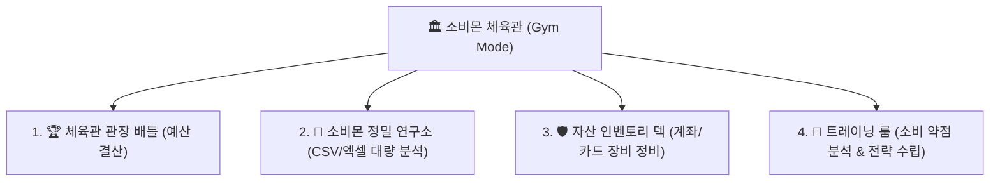

# 🏛️ 소비몬(SOBIMON) 프로페셔널 '체육관(Gym)' 모드 기획안

> **"지루한 회계 관리가 아닌, 다음 모험을 위해 체육관에 들러 장비를 정비하고 소비몬을 훈련시키는 특별한 시간"**

---

## 1. 기획 배경 & 핵심 세계관

### 1.1 일상 모험(Adventure)과 체육관(Gym)의 분리
- **스마트폰/아이패드 (탐험 모드 - Adventure Mode)**:
  - 길거리, 카페, 결제 직후 1초 만에 지출을 탭하고 백곰 캐릭터와 소통하는 캐주얼한 일상 모험.
  - 소비몬 발견, 일일 퀘스트 수행, 경험치 획득에 집중.
- **PC 대화면 (체육관 모드 - Gym / Professional Mode)**:
  - 넓은 모니터와 키보드를 활용해 한 달의 소비 데이터를 꼼꼼히 대조하고, 카드사 엑셀(CSV)을 일괄 업로드하며, 다음 달의 예산 전략을 정비하는 프로페셔널 공간.
  - 포켓몬스터에서 트레이너가 마을의 체육관(Gym)에 들러 배지에 도전하고 포켓몬을 육성하듯, **가계부 정산 행위 자체를 흥미진진한 의식(Ritual)**으로 승화.

---

## 2. 체육관(Gym) 모드 4대 핵심 재미 요소



---

### ① 🏆 체육관 관장 배틀 (월간 예산 결산 & 배지 수여)
- **콘셉트**: 각 소비 카테고리(식비, 카페, 쇼핑, 문화 등)마다 개성 넘치는 **체육관 관장 소비몬**이 존재.
- **게임 룰**:
  - 월초에 설정한 카테고리별 예산이 '체육관 관장의 공격력'이 됨.
  - 한 달 동안 예산 초과 없이 방어에 성공하면 **체육관 관장 격파!**
- **보상**:
  - **카테고리별 공식 체육관 배지(Badge)** 수여 (예: `카페몬 격파 배지`, `쇼핑몬 봉인 훈장`).
  - 체육관 명예의 전당(트로피 룸)에 영구 전시되며 대량의 EXP 및 골드 코인 지급.
  - 예산 초과 시: "관장의 맹공격에 예산이 무너졌습니다! 다음 달 재도전 티켓 발급" (유쾌한 패배 연출).

---

### ② 🔬 소비몬 정밀 연구소 (스마트 CSV / 엑셀 일괄 정산기)
- **콘셉트**: 카드사나 은행에서 다운로드한 엑셀/CSV 파일을 연구소 분석기에 통째로 넣고 정밀 분석.
- **PC 특화 기능**:
  - **드래그 앤 드롭 업로드**: 엑셀 파일을 체육관 중앙 분석기에 떨어뜨리면 화려한 스캔 애니메이션 작동.
  - **대량 소비몬 포획 연출**: *"분석 완료! 지난달 결제 내역에서 카페몬 28마리, 식비몬 14마리가 한 번에 감지되었습니다!"*
  - **스프레드시트형 빠른 편집(Quick Grid)**: 키보드 방향키와 숫자패드(Numpad), 단축키(Enter, Tab)로 수십 건의 카테고리 오분류를 1분 만에 초고속 수정.

---

### ③ 🛡️ 자산 인벤토리 & 장비 덱(Deck) 정비
- **콘셉트**: 통장, 신용카드, 체크카드, 비상금 계좌를 RPG 게임의 **장비 아이템 덱**으로 시각화.
- **세부 장치**:
  - **신용카드 내구도 게이지**: 이번 달 카드 사용 한도 대비 현재 청구 예정 금액을 내구도(Durability)로 표현. 내구도가 80% 이하로 떨어지면 경고 이펙트 발생.
  - **비상금 요새(Stash Fortress)**: 저축 통장의 잔액이 쌓일수록 요새 성벽이 높아지는 인터랙티브 그래픽.
  - **고정 지출 봉인함**: 넷플릭스, 통신비 등 매월 나가는 고정비를 마법 룬(Rune) 형태로 묶어 한눈에 관리.

---

### ④ 🥊 소비몬 트레이닝 룸 (지출 패턴 약점 분석 & 방어 전략)
- **콘셉트**: 내 소비의 '치명적인 약점(시간대, 장소, 충동구매 패턴)'을 데이터로 도출하여 다음 모험을 대비.
- **세부 장치**:
  - **소비 몬스터 레이더 차트**: 식비몬, 카페몬, 쇼핑몬 중 이번 달 가장 거대해진 몬스터의 속성 분석.
  - **심야 출몰 경보**: "밤 11시~새벽 1시에 배달몬이 집중 출현하여 84,000원의 데미지를 입혔습니다!"
  - **소비 방어 아이템 처방**:
    - `[배달앱 1회 무시 부적]`: 다음 주 배달 0원 미션 성공 시 코인 2배.
    - `[텀블러 방패]`: 카페 지출 3회 연속 절약 시 희귀 절약몬 진화.

---

## 3. PC 전용 체육관 대시보드 화면 설계 (Layout Concept)

완전 PC(1200px 이상) 화면에서 **3단 파노라마 대시보드** 형태로 시원하게 펼쳐지는 레이아웃:

```
+-----------------------------------------------------------------------------------------+
| [소비몬 체육관 🏛️]   현재 위치: 제1 소비 정비소     [⚔️ 모바일 탐험 모드] [🏛️ 체육관 모드 (선택)] |
+-----------------------+----------------------------------+------------------------------+
| [1. 트레이너 룸]      | [2. 정밀 거래내역 & 캘린더 테이블] | [3. 소비몬 배틀 & 통계 룸]    |
|                       |                                  |                              |
| • 백곰 마스코트 & 장비 | • 엑셀/CSV 드래그 업로드 영역    | • 이번 달 체육관 관장 현황  |
| • 트레이너 레벨 & 칭호 | • 스프레드시트 인라인 편집 테이블 | • 카테고리 도넛 레이더 차트  |
| • 체육관 배지 진열장  | • 날짜/키워드/금액 고속 필터링    | • 가장 위험한 거대 소비몬   |
| • 통장/카드 장비 덱   | • 키보드 연속 입력 (Numpad)      | • 체육관 보상 수령 버튼      |
+-----------------------+----------------------------------+------------------------------+
```

---

## 4. 모드 전환 인터랙션 (Seamless Mode Toggle)

1. **완전 PC 사이즈(1200px 이상)**에 접속 시 화면 우측 상단 헤더에 깔끔한 세그먼트 토글 배치:
   - **`[📱 탐험 모드]`**: 현재 완성된 세련된 스마트폰 뷰 (간편하고 귀여운 모바일 경험).
   - **`[🏛️ 체육관 모드]`**: PC 화면 전체를 100% 활용하는 3단 프로페셔널 대시보드.
2. **모바일 / 아이패드**에서는 복잡한 엑셀 작업 대신 기기에 최적화된 **반응형 대시보드** 유지.

---

## 5. 기대 효과 및 비즈니스 경쟁력

1. **타 가계부 앱과의 압도적인 내러티브 차별화**
   - 편한가계부(단순 회계 그리드)나 토스/뱅크샐러드(무미건조한 통계)와 달리, **"체육관에서 배지를 따기 위한 정비"**라는 명확한 게임적 동기부여 제공.
2. **라이트 유저와 헤비 유저 동시 만족**
   - 귀엽고 쉬운 걸 좋아하는 유저는 **모바일 탐험 모드**로 충분히 즐김.
   - 엑셀로 꼼꼼히 정리하고 싶은 파워 유저는 **PC 체육관 모드**에서 전문 회계 프로그램급의 쾌적함 경험.
3. **높은 유저 리텐션 (월말 복귀율 극대화)**
   - "월말에는 체육관 가서 이번 달 배지 따야지!"라는 강력한 리텐션 트리거 형성.
