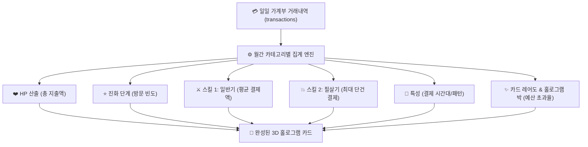

# 🎴 SOBIMON 동적 카드 스펙 변환 알고리즘 설명서

> **"지루한 가계부 지출 내역이 살아 움직이는 포켓몬 TCG 홀로그램 카드로 변환되는 핵심 공식 및 DB 연동 가이드"**

---

## 1. 개요 및 설계 철학

소비몬(SOBIMON) 가계부의 핵심 재미 요소는 **"내 실제 소비 습관이 카드 게임의 스탯으로 실시간 시각화되는 경험"**입니다.
* **소비가 늘어날수록**: 소비몬이 거대해지고(HP 증가), 흉포한 기술을 장착하며(고액 결제 필살기), 화려한 무지개빛 보스 카드(VMAX Ultra Rare)로 진화합니다.
* **절약에 성공할수록**: 소비몬은 힘을 잃고 얌전해지며(퇴화), 유저를 지켜주는 **황금 절약몬/수호신 카드**가 최고 등급(Secret Rare)으로 각성합니다.

---

## 2. 소비 데이터 ➡️ 카드 스펙 변환 공식 (Algorithm Formulas)



### ① 체력 (HP) 산출 공식
* **원천 데이터**: 해당 카테고리의 **이번 달 누적 지출액 (`total_spent`)**
* **공식**:
  $$\text{HP} = \min\left(340, \; 80 + \left\lfloor \frac{\text{total\_spent}}{2,000} \right\rfloor \times 10\right)$$
* **규칙**:
  * 기본 최저 HP: `80`
  * 포켓몬 TCG 최고 보스급 상한선: `340` (실제 포켓몬 VMAX 최고 체력 규격 반영)
  * 예시: 이번 달 카페에 **120,000원** 지출 시 $\rightarrow 80 + (60 \times 10) / 10 \rightarrow$ **HP 140**

---

### ② 진화 단계 (Stage) 판정 공식
* **원천 데이터**: 해당 카테고리 **월간 결제 빈도 (`visit_count`)**

| 진화 단계 (Stage) | 결제 빈도 (방문 횟수) | 카드 프레임 & 타이틀 |
| :--- | :--- | :--- |
| **기본 (Basic)** | 월 1회 ~ 4회 | 기본 소비몬 (예: `카페몬`) |
| **1진화 (Stage 1)** | 월 5회 ~ 11회 | 중급 소비몬 (예: `카페중독몬`) |
| **2진화 (Stage 2 - VMAX)** | 월 12회 이상 또는 예산 120% 초과 | 보스급 소비몬 (예: `카페대왕몬 VMAX`) |

---

### ③ 기술(Attacks) 및 데미지 수치 산출
실제 결제 금액 단위를 포켓몬 카드의 공격력으로 치환하여 현실감을 극대화합니다.

#### [스킬 1: 기본 공격기]
* **데미지**: 해당 카테고리의 **평균 결제 금액 (`avg_amount`)**
* **스킬명**: 일상적인 소비 패턴에서 자동 채택
  * 예: 카페몬 $\rightarrow$ `원두 샷 추가` (데미지: 4,500)
  * 예: 식비몬 $\rightarrow$ `사이드 메뉴 추가` (데미지: 8,000)

#### [스킬 2: 필살기 (Ultra Move)]
* **데미지**: 해당 카테고리의 **이번 달 단일 최고 결제액 (`max_amount`)**
* **발동 조건**: 1진화 이상 달성 시 해금
  * 예: 친구 몫까지 커피를 쏜 날 23,500원 결제 $\rightarrow$ 필살기: `골든 벨 라떼 폭풍 (데미지 23,500)`

---

### ④ 특성 (Ability) 패턴 매칭 알고리즘
결제 시각(`spent_at`)과 요일 분포를 클러스터링하여 유저의 소비 심리 약점을 특성으로 부여합니다:

| 분석 조건 | 부여되는 특성명 (Ability) | 효과 설명 |
| :--- | :--- | :--- |
| 결제 시각의 40% 이상이 **21:00 ~ 03:00** | **[야식의 망령]** | 밤 10시 이후 배달앱 알림 시 지갑 방어력을 50% 깎습니다. |
| 결제 건수의 60% 이상이 **토/일요일** | **[주말 보상심리]** | 평일 동안 쌓인 스트레스를 주말 결제로 폭발시킵니다. |
| 매월 **25일 ~ 말일** 사이 결제 집중 | **[월급날의 방심]** | 잔고가 채워진 순간 경계심이 풀려 대형 지출을 유발합니다. |
| 1회 결제 단가가 10만원 이상 발생 | **[무이자 할부의 마법]** | "3개월이면 한 달에 얼마 안 되잖아?" 환각을 겁니다. |

---

### ⑤ 약점 (Weakness) 및 저항력 (Resistance)
* **약점 (Weakness)**: 유저가 성공한 **방어 행동(절약 퀘스트)** 로그를 감지하여 매핑
  * 텀블러 할인 성공 기록 존재 $\rightarrow$ `약점: 텀블러 할인 (-300원)`
  * 장바구니 하루 보류 후 취소 기록 존재 $\rightarrow$ `약점: 24시간 숙성 결제 취소`
* **저항력 (Resistance)**: 유저가 자주 굴복하는 간편결제 시스템
  * `네이버페이 1초 간편결제`, `쿠팡 와우 무료배송`

---

### ⑥ 카드 레어도 (Rarity) & 홀로그램 박 효과

| 예산 대비 소진율 | 레어도 등급 | 홀로그램 비주얼 효과 |
| :--- | :--- | :--- |
| **0% ~ 70%** (안전) | **Common / Uncommon** | 은은한 광택, 일반 카드 프레임 |
| **71% ~ 99%** (주의) | **Holo Rare (★★★)** | 3D 무지개 회절박(`rainbow foil`) + 커서 추적 섬광 |
| **100% 초과** (경보) | **VMAX Ultra Rare (★★★★)** | 금빛 테두리 + 번개 파티클 + 풀 프레임 우주 홀로그램 |

---

## 3. 데이터베이스(DB) 아키텍처 및 집계 쿼리

### 3.1 테이블 설계 (PostgreSQL / Supabase 기준)

#### 1) `transactions` (원천 거래 내역)
```sql
CREATE TABLE transactions (
  id UUID PRIMARY KEY DEFAULT gen_random_uuid(),
  user_id UUID REFERENCES users(id) ON DELETE CASCADE,
  category VARCHAR(50) NOT NULL,        -- 'cafe', 'food', 'shopping', 'traffic' 등
  amount INT NOT NULL,                  -- 결제 금액 (원)
  store_name VARCHAR(100) NOT NULL,     -- 가맹점명
  memo TEXT,                            -- 메모
  spent_at TIMESTAMP WITH TIME ZONE DEFAULT NOW(),
  created_at TIMESTAMP WITH TIME ZONE DEFAULT NOW()
);
```

#### 2) `sobimon_monthly_stats` (월간 카드 스탯 집계 뷰)
카드를 열 때마다 무거운 계산을 매번 하지 않도록, 고속 집계 뷰를 생성합니다:

```sql
CREATE OR REPLACE VIEW sobimon_monthly_stats AS
SELECT 
  user_id,
  to_char(spent_at, 'YYYY-MM') AS month_key,
  category,
  COUNT(*) AS visit_count,
  SUM(amount) AS total_spent,
  ROUND(AVG(amount)) AS avg_amount,
  MAX(amount) AS max_amount,
  -- 최다 결제 시간대 (피크 타임)
  MODE() WITHIN GROUP (ORDER BY EXTRACT(HOUR FROM spent_at)) AS peak_hour
FROM transactions
GROUP BY user_id, month_key, category;
```

---

## 4. 프론트엔드 React 연동 가이드 (`SobimonHoloCardModal`)

현재 제작된 [SobimonHoloCardModal.jsx](file:///d:/03.기타/samfinace/src/components/common/SobimonHoloCardModal.jsx)는 아래와 같이 계산된 스펙 객체(`cardSpec`)를 넘겨받으면 실시간으로 즉시 렌더링됩니다:

```javascript
// 프론트엔드 변환 함수 예시 (util 함수)
export function calculateSobimonCardSpec(statData, budgetLimit = 150000) {
  const { category, visit_count, total_spent, avg_amount, max_amount, peak_hour } = statData;

  // 1. HP 계산 (기본 80 + 2000원당 10씩 증가, 최대 340)
  const hp = Math.min(340, 80 + Math.floor(total_spent / 2000) * 10);

  // 2. 진화 단계 판정
  let stage = '기본 (Basic)';
  if (visit_count >= 12 || total_spent > budgetLimit * 1.2) {
    stage = '2진화 (Stage 2 - VMAX)';
  } else if (visit_count >= 5) {
    stage = '1진화 (Stage 1)';
  }

  // 3. 레어도 판정
  const spentRatio = total_spent / budgetLimit;
  let rarity = 'common';
  let rarityText = '★ COMMON';
  if (spentRatio >= 1.0) {
    rarity = 'epic';
    rarityText = '★★★★ ULTRA RARE (VMAX)';
  } else if (spentRatio >= 0.7) {
    rarity = 'rare';
    rarityText = '★★★ HOLO RARE';
  }

  // 4. 특성 매칭
  let ability = {
    name: '자연스러운 소비 유도',
    type: '특성 (Ability)',
    desc: '결제 시 잔고를 조금씩 줄여나갑니다.'
  };
  if (peak_hour >= 21 || peak_hour <= 3) {
    ability = {
      name: '야식의 망령 (Midnight Feast)',
      type: '특성 (Ability)',
      desc: '밤 9시 이후 배달앱 알림이 울리면 배달팁 3,500원을 무감각하게 만듭니다.'
    };
  }

  return {
    hp,
    stage,
    rarity,
    rarityText,
    ability,
    attacks: [
      { name: '기본 결제 어택', damage: Number(avg_amount).toLocaleString(), desc: '평균적인 결제 유도' },
      ...(max_amount ? [{ name: '지갑 파괴 일격', damage: Number(max_amount).toLocaleString(), desc: '이번 달 단일 최고 결제' }] : [])
    ]
  };
}
```

---

## 5. 결론 및 향후 확장성

1. **지출 기록의 보상화**: 사용자가 영수증을 등록하고 가계부를 작성할 때마다 카드가 실시간으로 레벨업/진화하므로 가계부 작성이 게임처럼 즐거워집니다.
2. **절약 시 역전 쾌감**: 소비몬을 길들이고(절약 성공), 수호신 카드를 VMAX 황금 카드로 육성하는 성취감을 제공합니다.
3. **체육관 모드와의 결합**: 월말 체육관 관장 배틀에서 이 변환된 소비몬 카드 덱을 활용하여 보스 레이드를 진행할 수 있습니다.
