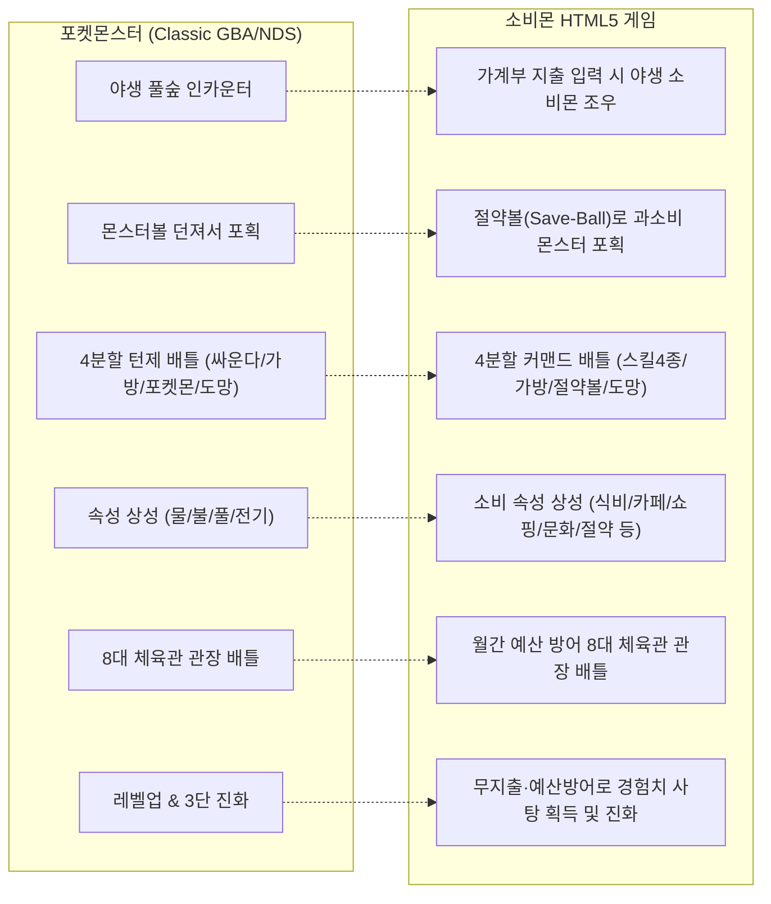
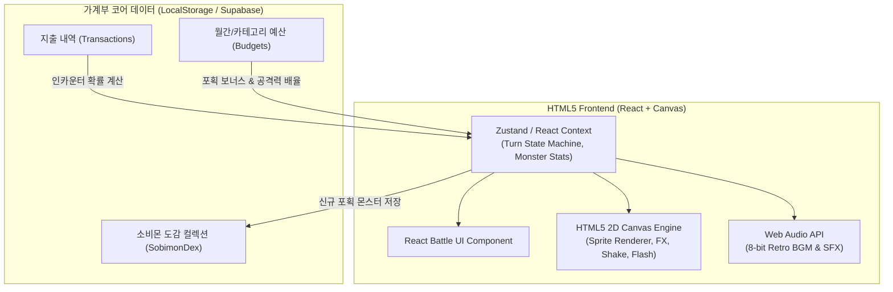

# 🎮 소비몬(SOBIMON) × 포켓몬스터 벤치마킹 HTML5 턴제 배틀 게임 기획서

> **부제**: "지출을 기록하면 야생 소비몬이 출현하고, 절약하면 내 파트너가 전설로 진화한다!"  
> **장르**: 턴제 수집형 금융 RPG (Turn-based Financial Creature-Collector RPG)  
> **구동 환경**: 모바일/PC 반응형 웹 (HTML5 Canvas + React + Web Audio)

---

## 1. 프로젝트 개요 & 세계관

### 1.1 핵심 콘셉트
- 전 세계 수억 명이 열광한 **'포켓몬스터(Pokémon)'의 클래식 턴제 배틀 및 포획(Catch) 시스템**을 완벽 벤치마킹합니다.
- 지루한 숫자 입력 중심의 가계부에서 탈피하여, **현실의 소비와 절약 행동이 게임 속 자원, 능력치, 몬스터 조우로 100% 직결**되는 혁신적인 게이미피케이션 가계부 게임입니다.

### 1.2 세계관 (The Lore)
- **배경**: 현대인의 지갑과 계좌 속에 숨어 사는 미지의 디지털 생명체 **'소비몬(Sobimon)'**.
- **트레이너(유저)**: 소비몬들의 무차별적인 통장 털기 공격에 맞서, 소비몬을 포획하고 교화하여 훌륭한 **'절약 파트너'**로 길러내는 금융 트레이너.
- **체육관(Gym)**: 각 소비 카테고리(외식, 카페, 쇼핑, 문화 등)를 지배하는 8대 과소비 보스 관장들이 지키고 있는 금융 요새. 유저는 절약으로 단련된 덱으로 이들을 쓰러뜨리고 **'8대 마스터 뱃지'**를 획득해야 합니다.

---

## 2. 포켓몬스터 ↔ 소비몬 핵심 시스템 매핑



---

## 3. 8대 소비 속성 & 상성 매트릭스 (Type Matchup)

포켓몬의 물/불/풀처럼, 소비 카테고리 간의 현실적인 라이프스타일 상성을 배틀에 적용합니다.

| 속성 | 대표 몬스터 | 강점 (1.5배 데미지) | 약점 (0.7배 데미지) | 콘셉트 설명 |
| :--- | :--- | :--- | :--- | :--- |
| **☕ 카페** | 카페냥 | 🎮 문화, 🛵 식비 | 🏃 건강, 🪙 절약 | 나른한 문화생활을 깨우지만, 건강 웰빙에 취약 |
| **🍔 식비/배달**| 배달팬더, 야식여우| 🛍️ 쇼핑, ☕ 카페 | 🏃 건강, 🪙 절약 | 배고픔은 쇼핑욕구를 덮지만, 다이어트와 절약에 무력화 |
| **🚕 교통** | 택시용 | 🏃 건강, 🎮 문화 | 🪙 절약, 🛵 식비 | 빠른 이동으로 체력을 아끼지만, 비용 폭탄과 환승에 약함 |
| **🛍️ 쇼핑** | 쇼핑토끼 | ☕ 카페, 🚕 교통 | 🪙 절약, 🍔 식비 | 물질적 풍요를 과시하지만, 본질적인 식비와 절약 결계에 막힘 |
| **🎮 문화/구독**| 넷플릭, 겜돌이 | 🚕 교통, 🛍️ 쇼핑 | ☕ 카페, 🏃 건강 | 집돌이 콘텐츠로 외출비용을 줄이나, 카페인과 운동에 취약 |
| **🏃 건강/의료**| 헬스곰 | ☕ 카페, 🍔 식비 | 🛍️ 쇼핑(장비욕구) | 건강한 루틴으로 정크푸드를 격퇴하지만, 헬스장비 쇼핑에 흔들림 |
| **🍺 유흥/술** | 술고래 | 🎮 문화, 🚕 교통 | 🏃 건강, 🪙 절약 | 분위기로 모든 걸 휩쓸지만, 다음 날 숙취와 카드값 영수증에 치명상 |
| **🪙 절약 (성속성)**| 절약요정 | **모든 과소비 속성에 1.5배**| 無 (상성 약점 없음) | 진정한 금융 치료사. 모든 과소비 스킬에 강력한 내성 보유 |

---

## 4. 10대 소비몬 배틀 상세 스펙 (Stats & 4 Skills)

각 소비몬은 **HP(체력), ATK(공격력), DEF(방어력), SPD(민첩성)**의 4대 스탯과 **4개의 고유 스킬**을 보유합니다.

### 1) ☕ 카페냥 (Cafenyang) - [카페 속성 / 스피드 딜러]
- **스탯**: HP 85 | ATK 110 | DEF 75 | SPD 125 (초고속 선공형)
- **스킬 세트**:
  1. `아메리카노 분사` (일반공격, 위력 40): 뜨거운 에스프레소를 뿜어 상대를 깜짝 놀라게 한다.
  2. `스탬프 10개 적립` (버프): 도장을 꽉 채워 다음 턴 공격력을 2배로 증폭한다.
  3. `카페인 과충전` (특수기, 위력 75): 심장이 쿵쾅거릴 정도의 각성 공격. 20% 확률로 상대에게 '불면(혼란)' 부여.
  4. `디카페인 힐링` (회복): 따뜻한 캐모마일 티를 마셔 최대 HP의 35%를 즉시 회복한다.

### 2) 🍔 배달팬더 (BaePanda) - [식비 속성 / 고체력 탱커]
- **스탯**: HP 140 | ATK 80 | DEF 115 | SPD 60 (끈질긴 방어형)
- **스킬 세트**:
  1. `배달팁 폭탄` (일반공격, 위력 45): 터무니없는 심야 배달팁을 청구하여 상대 멘탈을 깎는다.
  2. `리뷰 별점 5점 방패` (방어): 1턴 동안 상대의 모든 공격을 완벽하게 무효화한다.
  3. `최소주문 채우기` (특수기, 위력 80): 사이드 메뉴를 마구 추가하여 거대한 칼로리로 짓누른다.
  4. `식곤증의 휴식` (수면/회복): 잠에 빠져 1턴간 행동 불가지만 HP를 60% 회복한다.

### 3) 🛍️ 쇼핑토끼 (ShopRabbit) - [쇼핑 속성 / 테크니컬 크리티컬]
- **스탯**: HP 90 | ATK 115 | DEF 80 | SPD 110 (급소 타격형)
- **스킬 세트**:
  1. `타임세일 카운트다운` (특수기, 위력 50): 급소에 맞을 확률이 3배 높은 충동구매 타격.
  2. `무이자 12개월 할부` (연속기, 위력 20×3회): 미래의 나에게 빚을 지우며 3연속 난타.
  3. `장바구니 쏟아붓기` (특수기, 위력 85): 담아둔 물건들을 한꺼번에 결제하며 대폭발을 일으킨다.
  4. `단순변심 쿨환불` (상태이상): 상대의 버프 효과를 모조리 취소시키고 기본 상태로 되돌린다.

### 4) 🚕 택시용 (TaxiYong) - [교통 속성 / 고기동 딜러]
- **스탯**: HP 95 | ATK 105 | DEF 85 | SPD 130 (최강 스피드)
- **스킬 세트**:
  1. `심야 20% 할증` (특수기, 위력 55): 밤 11시 이후 사용 시 위력이 90으로 상승하는 조건부 필살기.
  2. `우회도로 드리프트` (회피/공격): 상대 공격을 회피하면서 스쳐 지나가며 데미지(위력 40)를 입힌다.
  3. `미터기 광속 상승` (지속피해): 상대에게 3턴 동안 매 턴 전체 체력의 12%에 달하는 통행료 데미지를 부여.
  4. `지하철 환승 할인` (방어): 급격히 지출을 방어하며 방어력을 2단계 상승시킨다.

### 5) 🎮 넷플릭 (Netflick) - [문화 속성 / 디버프 서포터]
- **스탯**: HP 100 | ATK 75 | DEF 95 | SPD 90 (혼란 마법형)
- **스킬 세트**:
  1. `오프닝 건너뛰기` (선공기, 위력 40): 무조건 상대보다 먼저 공격하는 초고속 공격.
  2. `다음 화 5초 카운트` (수면기): 강력한 흡입력으로 상대를 '정주행 멍때림(1~2턴 기절)' 상태에 빠뜨린다.
  3. `알고리즘 미혹` (명중률 저하): 상대의 추천 알고리즘을 조작해 기술 명중률을 30% 떨어뜨린다.
  4. `계정 4인 파티 공유` (버프): 아군 전체의 방어력을 1.5배 증가시키는 파티 결속.

### 6) 🍺 술고래 (SulGorae) - [유흥 속성 / 고위험 하이리턴]
- **스탯**: HP 130 | ATK 125 | DEF 70 | SPD 65 (폭발적 화력)
- **스킬 세트**:
  1. `골든벨 난사` (자해 특수기, 위력 110): 내 HP의 15%를 깎으면서 전장을 뒤흔드는 거대한 일격.
  2. `2차 가자 포효` (위협): 거친 기운으로 상대 공격력을 1단계 깎는다.
  3. `필름 끊기 스텝` (변칙): 50% 확률로 상대 공격을 완전 회피하거나, 내가 넘어짐.
  4. `숙취해소제 원샷` (상태이상 해제): 자신에게 걸린 모든 디버프를 치료하고 HP 25% 회복.

### 7) 🍗 야식여우 (NightFox) - [식비/야식 속성 / 암살자형]
- **스탯**: HP 80 | ATK 120 | DEF 70 | SPD 120 (고화력 암살)
- **스킬 세트**:
  1. `자정의 치킨 테러` (위력 65): 기름진 유혹으로 상대의 침샘과 지갑을 동시에 타격.
  2. `단짠단짠 콤보` (2회 공격, 위력 35×2): 단맛과 짠맛의 연속 공격.
  3. `유튜브 먹방 소환` (유혹): 상대가 공격 대신 음식을 쳐다보게 만들어 1턴간 행동 제한.
  4. `양치질 결계` (방어): 자기 전 양치를 완료하여 식욕을 봉인, 받는 데미지 반감.

### 8) 🕹️ 겜돌이 (GameDori) - [문화/게임 속성 / 극딜형]
- **스탯**: HP 85 | ATK 130 | DEF 65 | SPD 115 (도박형 죽창딜)
- **스킬 세트**:
  1. `가챠 10연차 뽑기` (랜덤공격): 위력 10 ~ 130 사이 랜덤 데미지가 터지는 로또 스킬.
  2. `천장 시스템 발동` (필살기, 위력 90): 5턴 이상 배틀이 지속되었을 때만 발동 가능한 무조건 명중 필살기.
  3. `한정판 패키지 광기` (공격력 2단계 상승): 방어력을 포기하고 공격력을 극대화.
  4. `출석 체크 보상` (회복): 소량의 HP(15%)를 매 턴 지속 회복하는 패시브 버프.

### 9) 🏋️ 헬스곰 (HealthGom) - [건강 속성 / 밸런스 브루저]
- **스탯**: HP 110 | ATK 110 | DEF 110 | SPD 80 (완벽한 육각형 스탯)
- **스킬 세트**:
  1. `3대 500 내리치기` (일반공격, 위력 60): 정직한 쇠질의 힘으로 상대 방어를 무시하고 타격.
  2. `프로틴 쉐이크 보충` (회복): 근육을 합성하여 HP 30% 회복 및 공격력 1단계 상승.
  3. `1년 회원권 봉인` (방어): 거대한 계약서 방패로 상대 공격 데미지를 70% 경감.
  4. `치팅데이 폭주` (특수기, 위력 85): 억눌렸던 식욕을 폭발시켜 적을 덮치는 묵직한 한 방.

### 10) 🧚 절약요정 (SaveFairy) - [절약 성속성 / 전설의 마스코트]
- **스탯**: HP 120 | ATK 100 | DEF 120 | SPD 100 (올라운더 전설급)
- **스킬 세트**:
  1. `무지출 결계` (방어/반격): 1턴간 공격을 막고 받은 피해의 50%를 상대에게 되돌려준다.
  2. `통장 쪼개기` (특수기, 위력 70): 흩어진 자산의 힘을 모아 빛의 파동으로 적을 정화한다.
  3. `복리의 마법` (스노우볼 버프): 턴이 지날 때마다 자신의 모든 스탯이 10%씩 복리로 영구 증가.
  4. `적금 만기 해지` (궁극기, 위력 120): 만기 통장의 엄청난 희열로 적 전체를 강타하는 피니시 기술.

---

## 5. 포획(Catch) & 볼(Ball) 메커니즘

포켓몬의 몬스터볼 던지기 공식을 소비 금융 데이터와 직관적으로 결합합니다.

### 5.1 포획 확률 공식
$$\text{포획 확률(\%)} = \left( \frac{3 \times HP_{max} - 2 \times HP_{cur}}{3 \times HP_{max}} \right) \times \text{볼 보너스} \times \text{금융 절약 보너스} \times 100$$

- **기본 룰**: 상대 몬스터의 HP가 낮을수록(빨간색 게이지) 포획 확률이 비약적으로 증가합니다.
- **금융 절약 보너스 (Game-Changer)**:
  - 당일/당월 잔여 예산이 50% 이상일 때: **포획 확률 × 1.3배**
  - **오늘 무지출 데이 달성 시**: **포획 확률 × 1.6배** (실제 절약이 포획 치트키가 됨!)

### 5.2 볼(Ball) 인벤토리 등급
1. **일반 절약볼 (Save-Ball)**: 기본 포획률 계수 1.0 (일일 출석 및 일반 기록 시 3개씩 충전)
2. **슈퍼 예산볼 (Budget-Ball)**: 기본 포획률 계수 1.5 (카테고리 예산 절약 퀘스트 성공 시 지급)
3. **하이퍼 저축볼 (Stash-Ball)**: 기본 포획률 계수 2.0 (주간 저축 챌린지 성공 시 지급)
4. **마스터 무지출볼 (Zero-Ball)**: 포획 성공률 100% 무조건 포획 (월간 무지출 5일 달성 시 지급되는 궁극의 볼)

---

## 6. HTML5 게임 화면 UI & 인터랙션 디자인

### 6.1 배틀 화면 와이어프레임 (모바일 세로 최적화)

```
┌────────────────────────────────────────────────────────┐
│  [Top Bar]  🪙 2,450 COIN    🎒 절약볼 × 5    [도감]  │
├────────────────────────────────────────────────────────┤
│                                                        │
│   [상대 야생 몬스터]                Lv.12 야생 카페냥  │
│                                     HP [███████░░░] 70%│
│                                    (부유 애니메이션)   │
│                                    [☕ 카페 속성]     │
│                                                        │
│               [배틀 필드 스테이지 그래픽]               │
│                                                        │
│   (내 파트너 뒷모습)                                   │
│   Lv.15 파트너 헬스곰                                  │
│   HP [██████████] 100%                                 │
│   SP [████░░░░░░] 40/100                               │
│                                                        │
├────────────────────────────────────────────────────────┤
│  [ 텍스트 대화창 / 배틀 로그 로그 뷰어 ]               │
│  "야생의 카페냥이 달콤한 라떼를 뿜어냈다! (효과가 굉장했다!)"│
├──────────────────────────┬─────────────────────────────┤
│   ⚔️  싸운다 (Fight)     │     🎒  가방 (Bag)          │
│   (4대 고유 스킬 창 열기) │     (회복 포션, 예산 부스터)│
├──────────────────────────┼─────────────────────────────┤
│   ⚾  절약볼 (Catch)     │     🏃  도망치기 (Run)      │
│   (몬스터볼 투척 포획)    │     (배틀 포기 및 도망)     │
└──────────────────────────┴─────────────────────────────┘
```

### 6.2 '싸운다(Fight)' 선택 시 4분할 스킬 창 전개
```
┌──────────────────────────┬─────────────────────────────┐
│  1. 3대 500 내리치기      │  2. 프로틴 쉐이크           │
│  [물리 / 위력 60 / SP 10] │  [회복·버프 / SP 15]        │
├──────────────────────────┼─────────────────────────────┤
│  3. 1년 회원권 방패       │  4. 치팅데이 폭주           │
│  [방어 / SP 12]           │  [필살기 / 위력 85 / SP 25] │
└──────────────────────────┴─────────────────────────────┘
```

---

## 7. 가계부 데이터 ↔ 게임 실시간 연동 시나리오

| 실생활 가계부 이벤트 | 게임 내 트리거 및 효과 |
| :--- | :--- |
| **1. 카페에서 커피 5,500원 결제 후 기록** | 즉시 팝업: *"앗! 풀숲에서 야생의 [카페냥]이 나타났다! 지금 배틀하시겠습니까?"* ➔ 배틀 진입 |
| **2. 오늘 하루 지출 0원 (무지출 데이 달성)** | *"오늘의 절약 방어 성공!"* ➔ 파트너 소비몬 전원 HP 완전 회복 + 황금 경험치 사탕 3개 지급 |
| **3. 이번 달 배달비 예산 15만 원 방어 성공** | 체육관 관장 배틀 해금: *"[식비 체육관 관장: 배달팬더 킹]과의 결승전이 시작됩니다!"* |
| **4. 친구와 영수증 더치페이 정산 완료** | 배틀 파티원 간 '협동 링크(Link)' 발동 ➔ 콤보 스킬 게이지 풀충전 |

---

## 8. 기술 스택 및 개발 아키텍처



1. **경량 프론트엔드 엔진**:
   - 무거운 외부 엔진(유니티 등)을 배제하고, 기존 Vite + React 환경에서 **HTML5 Canvas 2D 컨텍스트**로 몬스터 스프라이트 바운스, 피격 깜빡임, 볼 투척 곡선 궤적을 60fps로 매끄럽게 렌더링.
2. **턴 관리 상태 머신 (Turn State Machine)**:
   - `START_BATTLE` ➔ `PLAYER_INPUT` ➔ `RESOLVE_PLAYER_MOVE` ➔ `ENEMY_AI_MOVE` ➔ `CHECK_FAINT_OR_VICTORY` ➔ `END_BATTLE`.
3. **레트로 사운드 (SFX)**:
   - Web Audio API 합성기를 사용해 포켓몬 특유의 레트로 효과음(볼 열리는 소리, 피격 타격음, 레벨업 팡파르)을 0.05MB 초경량으로 재생.

---

## 9. 단계별 개발 로드맵 (Milestones)

### 🚩 Phase 1: 턴제 배틀 & 포획 샌드박스 프로토타입 (즉시 구현 가능)
- `BattleScene.jsx` 컴포넌트 신규 개발.
- 내 파트너(헬스곰) vs 야생 카페냥 간의 턴제 배틀 구현.
- 4가지 커맨드(공격, 버프, 절약볼 투척 포획, 도망) 및 HP 감소 애니메이션 완성.

### 🚩 Phase 2: 가계부 데이터 동기화 & 도감 파티 덱(Deck) 구성
- 지출 입력 시 해당 카테고리 소비몬이 출현하는 인카운터 모듈 연동.
- 포획한 소비몬을 `SobimonDexTab.jsx`의 내 덱(최대 6마리 엔트리)으로 등록하고 육성.
- 무지출 데이 달성 시 경험치 사탕 지급 및 레벨업 시스템 탑재.

### 🚩 Phase 3: 8대 체육관 관장 레이드 & 랭킹 시스템
- 월말 결산 체육관 관장 보스전 콘텐츠 오픈.
- 관장 격파 시 프로필에 장착 가능한 홀로그램 뱃지(Badge) 수여.
- 친구 또는 다른 사용자 덱과 비동기 대결할 수 있는 주간 금융 아레나 오픈.

---

**작성자**: 소비몬(SOBIMON) 개발 & 기획팀  
**최종 업데이트**: 2026년 9월 8일
